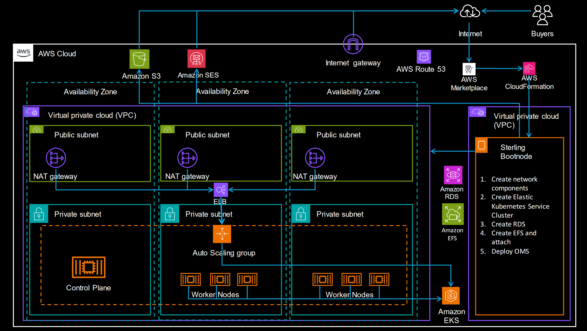

Here's the updated `README.md` file with parameters aligned to the CloudFormation template provided:

---

# IBM Sterling OMS Deployment on AWS

This repository contains infrastructure-as-code (IaC) templates for deploying IBM Sterling Order Management System (OMS) on Amazon Web Services (AWS). The deployment leverages AWS CloudFormation for creating and managing the necessary AWS resources, such as EC2 instances, security groups, IAM roles, and other resources.

## Getting Started

### Prerequisites

- An AWS account with appropriate permissions to create EC2 instances, IAM roles, security groups, and other resources.
- An existing EC2 Key Pair for accessing the EC2 instance.
- IBM Entitled Registry Key for deploying IBM Sterling OMS.
- Basic knowledge of AWS, CloudFormation, and EC2 instances.

### Architecture Diagram

*Architecture that shows the interaction between EC2, EKS, RDS, EFS, and other AWS resources.*

### Database Options

The following databases are supported as prerequisites for the IBM Sterling OMS deployment:

1. **[DB2 on EC2](db2/DB2_README.md)**: A CloudFormation template to deploy a DB2 database on an EC2 instance. This requires the DB2 installer to be available in an S3 bucket.
2. **[PostgreSQL on RDS](postgresql/postgresql_README.md)**: A CloudFormation template to deploy a managed PostgreSQL instance on Amazon RDS.

You can choose one of these database options based on your environment and preferences.

---

### CloudFormation Template Execution

To deploy IBM Sterling OMS using the CloudFormation template:

1. **Download the CloudFormation template:**
   - Ensure the CloudFormation template is available on your local machine or in an S3 bucket.

2. **Navigate to the AWS Management Console:**
   - Go to the [CloudFormation Console](https://console.aws.amazon.com/cloudformation).

3. **Create a new CloudFormation stack:**
   - Click on "Create Stack" and choose "With new resources (standard)".
   - Upload the CloudFormation template file or provide the S3 URL if the template is hosted in an S3 bucket.

4. **Provide the necessary parameters:**

   | Parameter             | Description                                                                                 | Example Value             |
   |-----------------------|---------------------------------------------------------------------------------------------|---------------------------|
   | `KeyName`             | Name of an existing EC2 Key Pair for SSH access to the instance.                            | `my-key-pair`             |
   | `InstanceName`        | Name for the instance to be created.                                                        | `sterling-oms`            |
   | `ClusterSize`         | Preferred cluster size for the EKS cluster (small, medium, large).                          | `small`                   |
   | `EntitlementKey`      | IBM Entitled Registry Key.                                                                  | `your-entitlement-key`    |
   | `License`             | Accept the license terms (Accept/Decline).                                                  | `Accept`                  |
   | `Edition`             | OMS Edition to deploy (professional or enterprise).                                         | `enterprise`              |
   | `Version`             | Version of IBM Sterling OMS to deploy (e.g., `10.0.2306.0`).                                | `10.0.2306.0`             |
   | `DomainName`          | The public domain name for accessing the Sterling OMS instance.                             | `example.com`             |
   | `DatabaseType`        | Type of the database to use (DB2 or PostgreSQL).                                            | `PostgreSQL`              |
   | `DatabaseHostName`    | Hostname or IP address of the database server.                                              | `rds.amazonaws.com`       |
   | `DatabasePort`        | Port number for database connection.                                                        | `5432`                    |
   | `DatabaseUserName`    | Username for connecting to the database.                                                    | `dbadmin`                 |
   | `DatabasePassword`    | Password for the database user. (Hidden for security)                                       | `your-password`           |
   | `DatabaseSchema`      | Schema name to use within the database.                                                     | `oms_schema`              |
   | `DatabaseName`        | Name of the database.                                                                       | `omsdb`                   |

5. **Review and create the stack:**
   - After filling in the parameters, review the settings, acknowledge the IAM resources being created, and click "Create Stack".

6. **Monitor the stack creation:**
   - The stack will begin to create the required resources. You can monitor the progress in the "Events" tab of the CloudFormation stack page.
   - Once the stack is created successfully, your Sterling OMS instance and supporting AWS resources will be provisioned.

---

### Resources Created

- **EC2 Instance**: An EC2 instance to host the Sterling OMS setup.
- **Security Group**: A security group allowing SSH (port 22) access to the EC2 instance.
- **IAM Role and Policies**: IAM roles and policies for managing EC2, EKS, RDS, and other AWS services.
- **EKS Cluster**: An EKS cluster based on the specified cluster size (small, medium, large).
- **EFS**: Amazon EFS for shared storage used by the OMS system.

---

### Post-Deployment

Once the stack creation is complete:

- SSH into the EC2 instance using the Key Pair and the public IP of the EC2 instance.
- The Sterling OMS deployment scripts will be downloaded and executed automatically as part of the EC2 UserData.
- Logs for the deployment process will be stored in `/oms-deploy-aws/logs/` on the EC2 instance.

---

### Technical Stack

**Platform**:  
- **EKS (Elastic Kubernetes Service)** - Managed Kubernetes environment for running IBM Sterling OMS.
- **EC2 (Elastic Compute Cloud)** - Instance hosting for script execution and OMS deployment.

**Storage**:  
- **Amazon EFS (Elastic File System)** - Shared storage for Sterling OMS.
- **Amazon RDS (Relational Database Service)** - PostgreSQL database for Sterling OMS or DB2 on EC2.

---

### License

By using this CloudFormation template, you must accept the IBM Sterling OMS license agreement.
